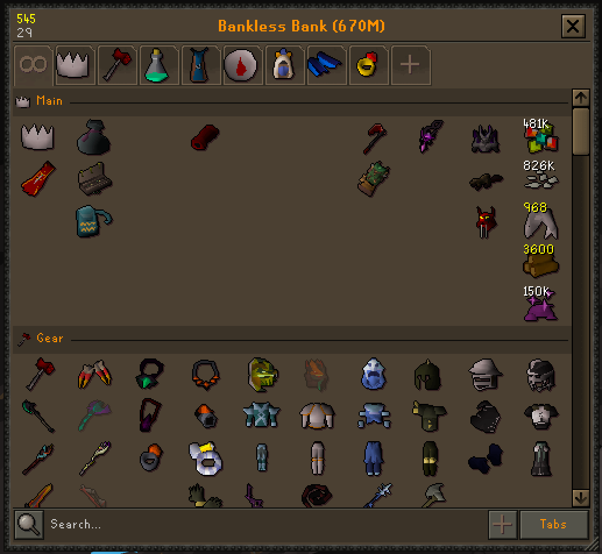
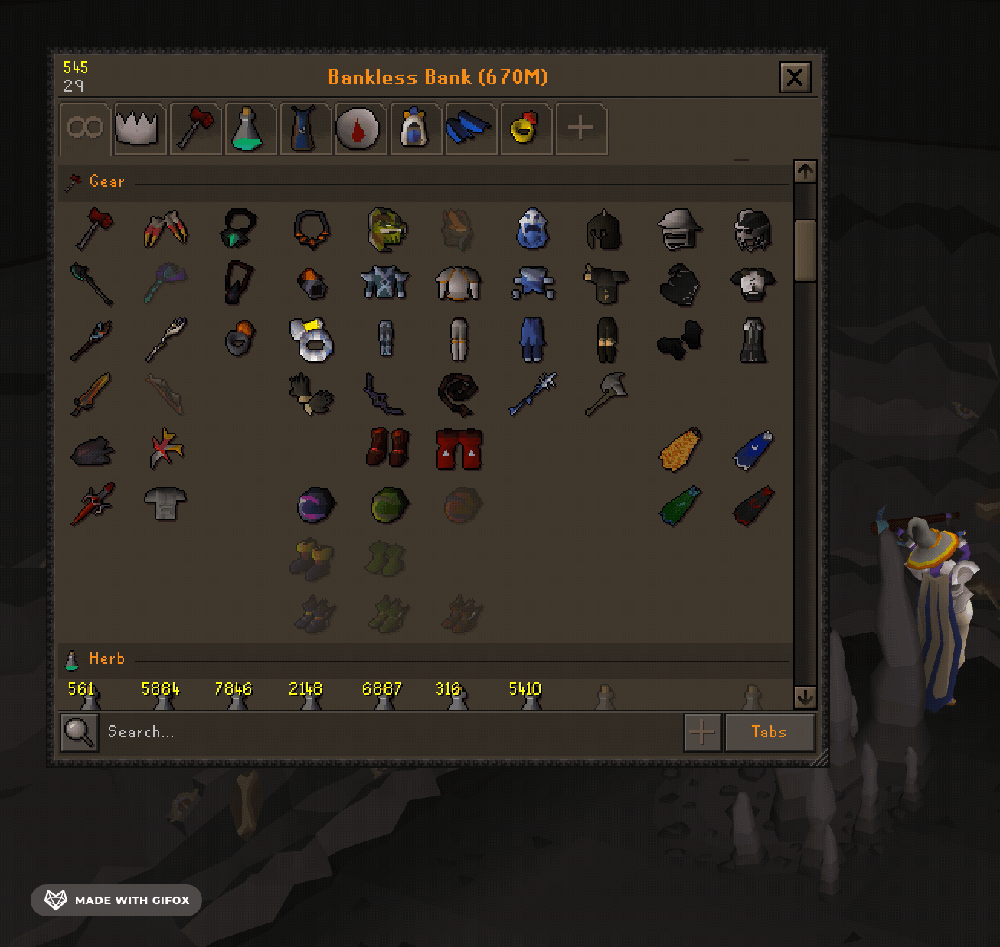
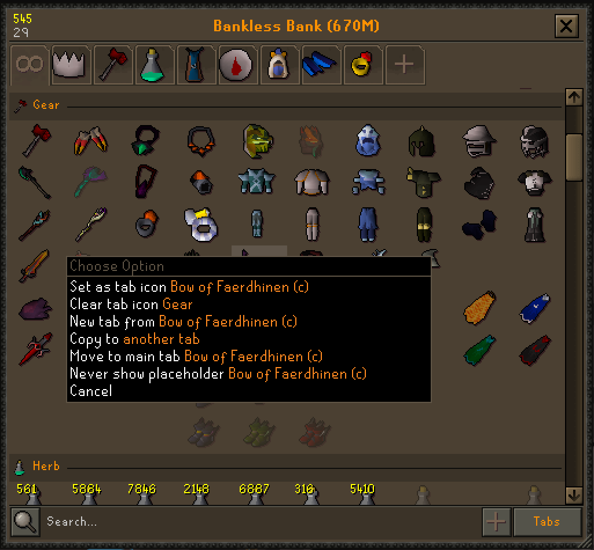
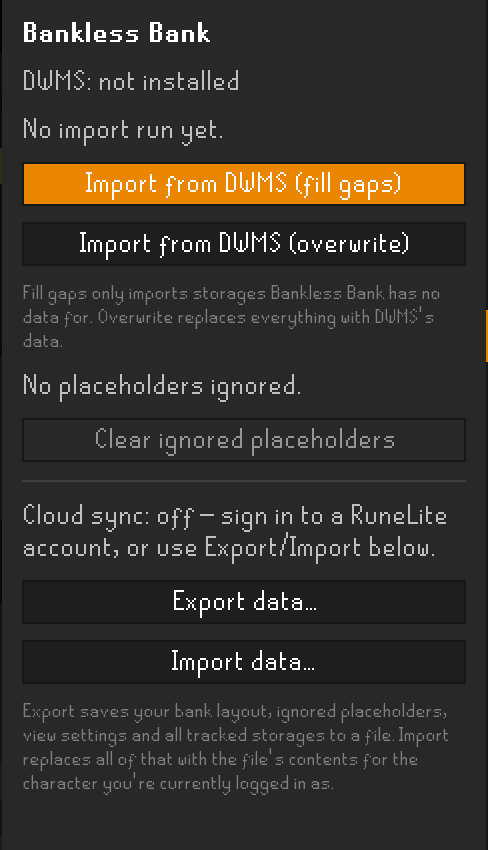

# Bankless Bank

##### A plugin for [RuneLite](https://runelite.net/)

A bank-style, in-game view of every item you own, without walking to a bank. Built for Ultimate
Ironmen (UIM). They can't use a real bank at all, so their items end up scattered across
inventory, equipment, the looting bag, the player-owned house, STASH units, and death storage.
Bankless Bank is a *viewer* only: it draws its own bank-style window, but there is no
withdrawing or depositing.

## Preview

## What it tracks

- Inventory, equipment, and the looting bag
- Carryable containers: rune pouch, herb sack, seed box, bolt pouch, quiver, tackle box,
  chugging barrel, plank sack, bottomless bucket, master scroll book, gnomish firelighter,
  huntsman's kit, forestry kit, bow string spool
- Death storage: deathpiles, graves, and Death's Office, including expiry timers
- Player-owned house: costume room, menagerie, spice rack, cape hanger
- World storages: leprechaun, fossil storage, log storage, potion storage, bird nests, compost
  bins, blast furnace, and other fixed drop points
- STASH units
- Sailing: active and lost boat holds

Coins and minigame points aren't tracked. They aren't items you'd see in a real bank.

## Features

- Up to 20 tabs plus an "all" view, each with its own chosen icon. The tab strip wraps onto
  extra rows as you add more, instead of scrolling out of reach.
- Free-floating slots: drag an item anywhere in the grid and it stays exactly where you put it,
  gaps included, just like the real bank.
- The same item can be filed into several tabs at once, not just one.
- Placeholders for items you no longer own, on by default. Release them one at a time or for a
  whole tab, or hide a specific item permanently with the "never show placeholder" ignore list.
- Grand Exchange values for the tab you're viewing, shown in the title bar and per item in
  tooltips.
- Search runs through the game's own chatbox prompt, so plugins that grab keys (like WASD
  camera) never get in the way.
- Storage mode lists items by where they physically are (looting bag, POH, a specific STASH
  unit, and so on) instead of by tab.
- Resize the window from the bottom-right corner, 4 to 16 columns and 3 to 20 rows. Each tab
  keeps its own layout width independent of the window size.
- Manual add: search for an item you don't own yet and drop it in as a placeholder for when you
  pick it up.
- Export and import save every bit of Bankless Bank data to a file and load it back in, useful
  if you're not signed into a RuneLite account.
- One-time import from Dude, Where's My Stuff? brings your STASH units, POH, and old death piles
  across from an existing DWMS install in one click. DWMS isn't needed after that.
- Your layout and tracked storages sync with your RuneLite account automatically once you're
  signed in.

## How to use

Open the view three ways, all from anywhere in the game:

- An always-visible HUD button on the game canvas
- The Bankless Bank button in the RuneLite sidebar
- A configurable hotkey

Once open, it behaves like the real bank: a title bar you can drag to reposition, a tab strip,
an item grid, search, and a scrollbar. Drag items around the grid, drag them onto a tab button
to file them, or onto **+** to start a new tab. Right-click an item for placeholder options or
to set it as a tab's icon; right-click a tab for rename, "release all placeholders", "collapse
blank spaces", or delete.

<!-- screenshot: tab strip wrapped onto two rows with several tabs -->

If you've already got items sitting in STASH units, your POH, or an old death pile from before
installing Bankless Bank, importing from [Dude, Where's My Stuff?](https://github.com/Thource/dude-wheres-my-stuff)
picks all of that up in one go instead of making you revisit every storage. This runs
automatically on first login if you have DWMS data and none of your own yet, or manually from
the sidebar panel.

## FAQ

**Can I withdraw or deposit items from this window?**
No. Bankless Bank only shows you what you own and where it is. It never moves anything. Use it
to check your gear at a glance, not as a bank replacement.

**Do I need Dude, Where's My Stuff? installed?**
No. It's only used once, to bring across items that were sitting in storages (STASH units, POH,
old death piles) before you installed Bankless Bank. After that import, Bankless Bank tracks
everything itself and DWMS can be removed.

**Will my layout follow me to another computer?**
Yes, automatically, as long as you're signed into a RuneLite account. Your tabs, placeholders,
and every tracked storage sync with your account, no setup needed. If you're not signed in, use
**Export data…** / **Import data…** in the sidebar instead.

**What happens to a slot when I stop owning that item?**
It becomes a greyed-out placeholder, just like a real bank, so your layout doesn't reshuffle
every time you use something up. Placeholders can be turned off globally, released individually,
released for a whole tab, or hidden permanently per item via the ignore list.

**Can the same item live in more than one tab?**
Yes. An item can be copied into several tabs, so you can group it under more than one theme
without picking just one home for it.

## Issues/Suggestions

Found a bug? Have a suggestion?

- [Open a new ticket on GitHub](https://github.com/robrichardson13/bankless-bank/issues/new)

## Support

